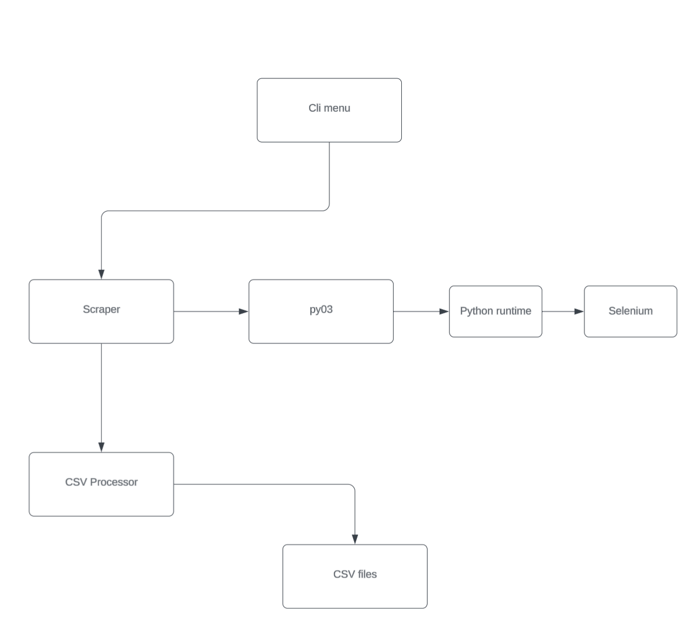
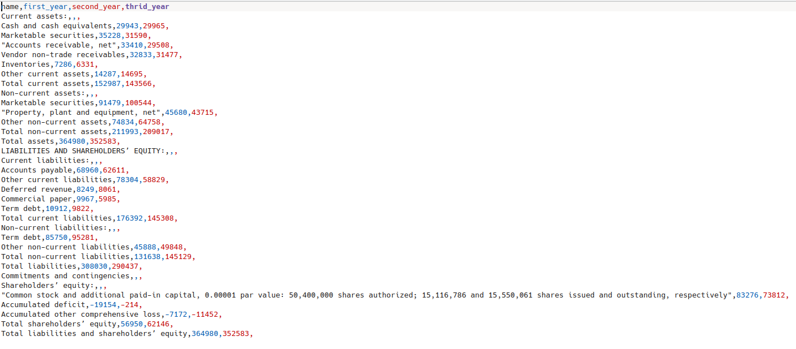
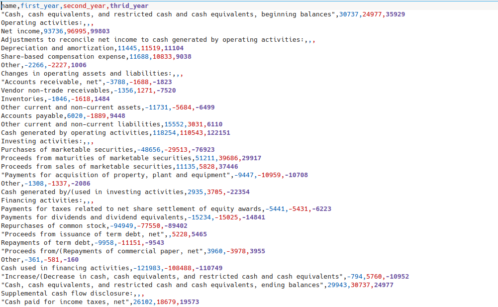
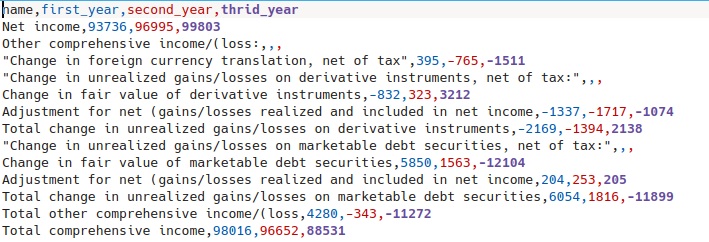

# Finance Scraper
This project aims to be a simple web scraping application for which is used to scrape publically available financial information, namely their INCOME/BALANCE SHEETS/CASH FLOW statments about companies and processes the data into a csv so regular analysis can be performed.

## How It's Made:

**Tech used:** Rust, Python (Selenium library)

Project implements both the Rust and Python programming langauge and libraries to scrape financial data 
from publically listed companies on the american stock exchange. Although currently only able to scrape for Apple,
eventually the project will be scrape other companies information listed in their quartely earnings.
The scrapped data is then processed by the Rust runtime to then be formatted into csv format. A cool feature used is the rust py03 library which is able to parse both data and arguments to and from both runtimes sperately.

Python is used for the selenium library and Rust is used for menu interaction and data processeing. Some work has also been 
made on contanerizing the application for potential usage in a Docker environment And a web api possibly will be used to access data.

## Optimizations

Currently no optimizations have been implemented although extensive unit tests are available in each seperate crate to ensure each fucntion is running as expected.

Will need to add further cli options to make program run smoother. Possibly considerint containerisation of project also.

## How to run program:

add path location of current working directory and firefox location into the repective variables in .env file

- CURRENT_DIR=(working directory)
- APP_ENV=production (leave as production)
- WEB_DRIVER=(location of fireforx driver)

install python dependencies from requirements.txt

make sure your python folder is in the same folder as your current working directory

you can specify the year and quarter you wish to scrape, if no arguments are specified, an option will apear to run a default scrape.

scraping each quarter for 2020-2024. ensure your internet speeds is configure adequatley.

## Project Reflections:

This was quite a complicated project using many different libraries. A project of this scale and having two langauges in unison is the biggest feat accomplished in this project. While also using an automation library suchas selenium, order to programiatically locate relevant data is a skill in which I will build upon for future projects.

## Examples:
Cli app produces two csv files for each INCOME/CASH FLOW/BALANCE SHEET statments for the year/quarter:

**Balance sheet**

**Income statement**

**Cash flow statment**